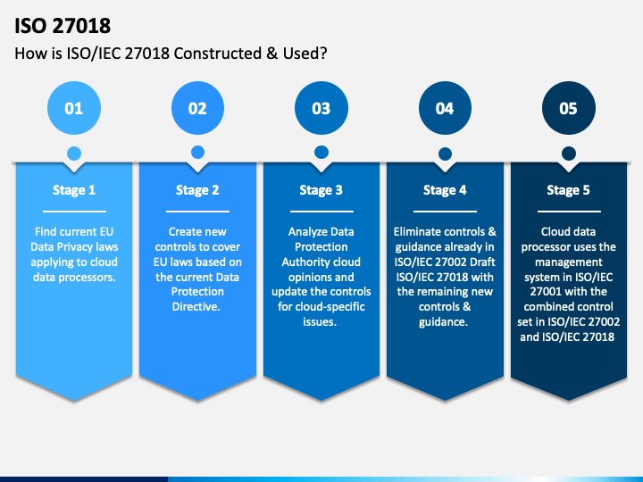

> # ISO 27018
  
> ## Intro  
>ISO 27018 is een veiligheidsstandaard die onderdeel is van 27000 familie en ontworpen is in 2014. Het was de eerste internationale standaard die over privacy in de Cloud gaat en gepromoot werd door bedrijven.

> ### Wat is het?
> ISO 27018 is een norm die gaat of het beveiligen van persoonsgegevens in de Cloud. Denk hierbij aan informatie over klanten, patiënten en burgers. De ISO 27018 standaard is voornamelijk bedoeld voor public Cloud providers zoals Microsoft en Amazon.  ISO 27018 is een uitbreiding op de ISO 27001 en 27002 standaard die ook over beveiliging van persoons gegevens gaat. De standaard is in het leven geroepen door de veel terugkomende vraag vanuit de Europese privacy-toezichthouders waar persoonsgegevens worden opgeslagen en wie er allemaal mee werken.
>   
> Vanuit deze vragen zijn er verschillende eisen opgesteld zoals :  
>- **Toestemming** er mogen alleen persoonsgegevens opgeslagen worden de klant hiervoor toestemming heeft gegeven.
>- **Beheer** Klanten moeten ten alle tijden inzicht kunnen krijgen in de data.
>- **Transparantie** Het moet duidelijk zijn waar de gegevens opgeslagen zijn.
>- **Communicatie** In het geval van een data lek moet de klant op de hoogte gebracht worden.
>- **Personeel** Iedere medewerker die met persoonsgegevens werkt moet een geheimhoudingsplicht tekenen.
>- **Overheid** Wanneer overheidsinstanties toegang hebben gekregen tot persoonsgegevens dient de klant op de hoogte gesteld te worden bijdragen aan Cloud processen.
>  
> In onderstaande video wordt er gesproken over ISO 27001 en 27018. Er wordt toegelicht dat je als bedrijf niet moet kiezen tussen de 27001 en 27018 maar dat je moet kiezen voor beide.  
> Daarnaast wordt ook toegelicht dat ISO27018 alleen niet voldoende is om te voldoen aan bijvoorbeeld de GPDR.
>
>
  
> ### Bijdragen aan Cloud processen
>Het doel van ISO 27018 is om een standaard te creëren als het gaat om het beveiligen van persoonsgegevens. Naast de beveiliging van persoonsgegevens brengt het ook andere voordelen met zich mee.  
> - Zo kunnen stakeholders meer vertrouwen in het bedrijf krijgen doordat ze weten dat er goed met hun omgegaan wordt en dit komt weer ten goede van het Imago van het bedrijf. 
> - Als bedrijf kunnen je risico beter inschatten doordat er meer inzicht en controle is over data en het personeel wat er mee werkt.
>   
>Dit zorgt ervoor dat het Cloud Governance onderdeel binnen het bedrijf beter en makkelijker uit te voeren is. Het bedrijf is namelijk gewend om met standaarden te werken waardoor het gebruik hiervan voor een ieder duidelijk is. Dit geld voor zowel interne als externe stakeholders. Niet te vergeten dat het leveren van een standaard in de loop van de tijd nog extra toevoegingen kan doen doordat er eventueel een deel geautomatiseerd kan worden omdat dit vaker voorkomt.
>   

> ### Cloud Governance en ISO 27018
>ISO 27018 heeft relatief weinig raak vlak met de onderdelen van Cloud Governance. Binnen Cloud Governance worden de volgende onderwerpen behandeld : kostenbeheer, beveiligings basislijn, identiteitsbasislijn, resourceconsistentie en Implementatieversnelling.  
>Al deze onderwerpen hebben weinig tot geen raak vlaak met de ISO 27018 norm. Kostenbeheer, identiteitsbasislijn, resourceconsistentie en Implementatieversnelling  worden namelijk niet behandeld binnen ISO 27018.  
>Beveiligings basislijn daarin tegen heeft wel raak vlaak met ISO 27018. Binnen het onderwerp worden onderdelen behandeld zoals encryptie, sjablonen voor beveilig, bedrijfsrisico’s en het naleven van processen. 
> 
>
> #### Sjabloon voor de Beveiligingsbasislijn
> Wanneer je aan de ISO 27018 norm wilt voldoen zullen er standaarden opgesteld moeten worden waaraan de data moet voldoen. Denk hierbij aan een watermark door een kopietje heen van een rijbewijs of paspoort. 
> Dit soort werkwijze dienen opgenomen te worden in een proces en dat valt wel een beetje onder dit kopje.
>  
>
> #### Bedrijfsrisico’s
>Onder bedrijfsrisico’s kan je het onderwerp certificering plaatsen. Wanneer je als bedrijf de ISO 27018 certificering niet behaald kan je veel klant verliezen doordat het Imago van het bedrijf beschadigd raakt. Dit bewijst namelijk dat er niet wordt voldaan aan de eisen van de certificering. Hierdoor zijn er aandachtspunten die open blijven die eerst opgelost moeten worden totdat de volgende keer er weer zijn.  
>Klanten kunnen namelijk vanuit de branche verplicht gesteld worden om aan persoonsgegevens beveiliging te doen of kunnen zelf een ISO 27001 certificering hebben waarvan ze bang die kwijt te raken doordat hun Cloud provider die ook niet meer heeft. Hiermee wordt de vertrouwensrelatie dus beschadigd en de klanten zullen het bedrijf niet meer adviseren.  
> 
>
> #### Naleven van processen
>Wanneer je als berdrijf ISO 27018 gecertificeerd bent zullen er waarschijnlijk verschillende processen opgesteld zijn die nageleefd dienen te worden. 
>De processen dienen voor de certificering voortdurend nagestreefd en bewaakt te worden iets wat onder het kopje “Naleven van processen” valt dus.  
>   
> *B. (2019, 17 september). De vijf disciplines binnen cloudgovernance*
> 
> ### Wat zijn de sterke punten en wat niet? 
>ISO 27018 is op het gebied van gegevens bescherming heel sterk. Het heeft als basis de ISO 270001 en 270002 standaard waar ook gegevens beveiliging in opgenomen is. Binnen ISO 27018 worden verschillende normen behandeld waar een bedrijf aan moet voldoen als het gaat in security denk hierbij aan encryptie en bijvoorbeeld rechten op bestanden zodat niet elke medewerker iets kan inzien.  
>Naast beveiliging van persoonsgegevens worden er binnen de ISO 27018 geen andere onderdelen behandeld. Hiervoor zijn er andere ISO standaarden die het bedrijf heeft ontworpen.
>
> ### Grote public Cloud providers
> Binnen de public Cloud providers zijn er veel leveranciers die de ISO 27018 certificering hebben en deze na leven. Zo heeft b.v. Microsoft Azure, Amazon AWS en Google Cloud de certificering. En kan je als klant op verschillende vlakken dit ook merken. Zo heb je bijvoorbeeld binnen Azure de mogelijkheid om zelf te bepalen in welke wereld deel je je data kan opslaan en kan je bij google je persoonlijke data opvragen.  
>
> In de afbeelding hieronder is goed te zien waar een public cloud provider zich continu mee bezig moet houden. Dit is niet alleen voor een nieuwe process maar ook voor bestaande processen.
> Wanneer er namelijk regels aangepast worden moeten er opnieuw gekeken worden naar deze stappen.  
>   
> 
>   
> ##### Bronvermelding
> 
> - B. (2019, 17 september). De vijf disciplines binnen cloudgovernance - Cloud Adoption Framework. Microsoft Docs. https://docs.microsoft.com/nl-nl/azure/cloud-adoption-framework/govern/governance-disciplines
> 
> - Gallego, D. (2020, 4 mei). ISO 27018. Security and Protection of Personal Information in the Cloud. GlobalSUITE Solutions. https://www.globalsuitesolutions.com/iso-27018-security-and-protection-of-personal-information-in-the-cloud
>
> - Atzema, H. (z.d.). ISO 27018, de nieuwe standaard voor privacy in de cloud? ICT Recht. Geraadpleegd op 22 december 2020, van https://www.ictrecht.nl/blog/iso-27018-de-nieuwe-standaard-voor-privacy-in-de-cloud
>
> - ISO 27018 PPT Slide 2. (z.d.). [Illustratie]. https://www.sketchbubble.com/. https://cdn.sketchbubble.com/pub/media/catalog/product/optimized1/0/1/016e52fceb97d215ebb0238a91212d1cca073c266d8e8225ebd4ecf915d428e9/iso-27018-slide2.png
>